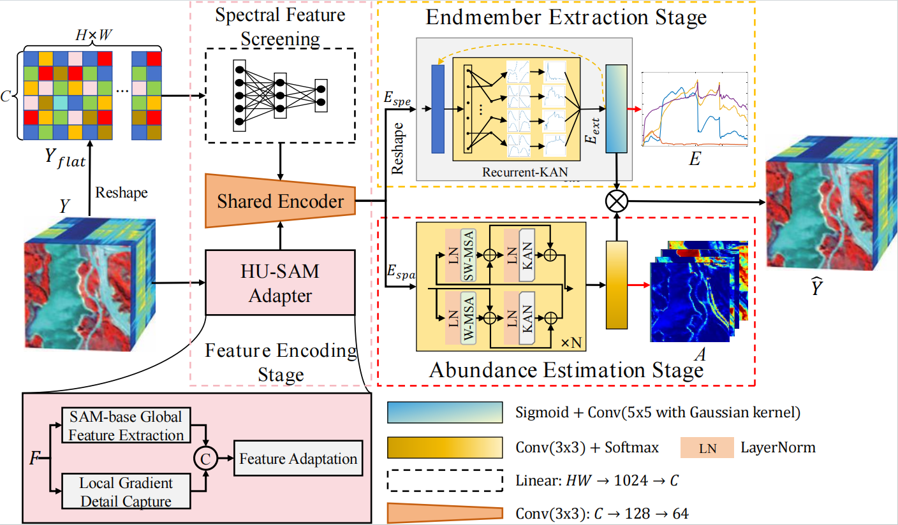
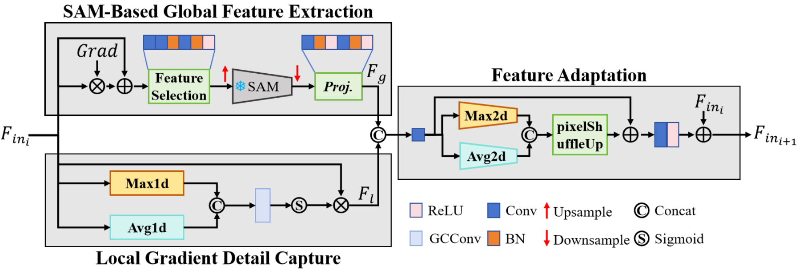
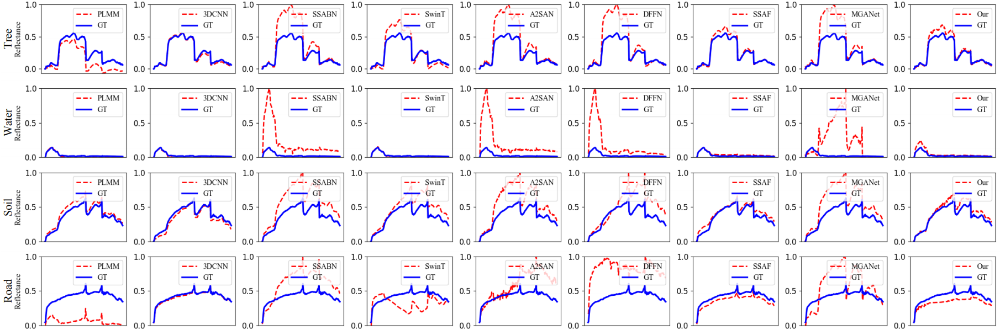
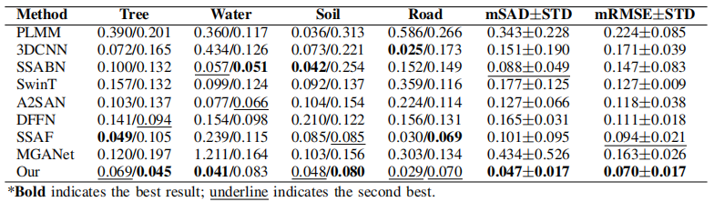
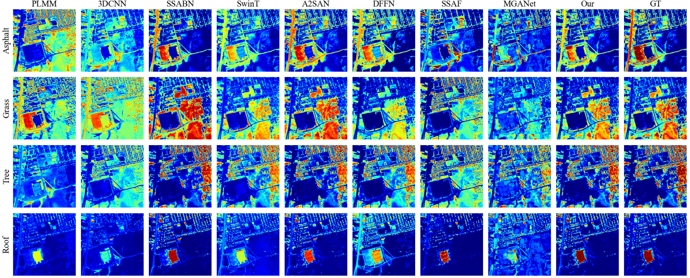
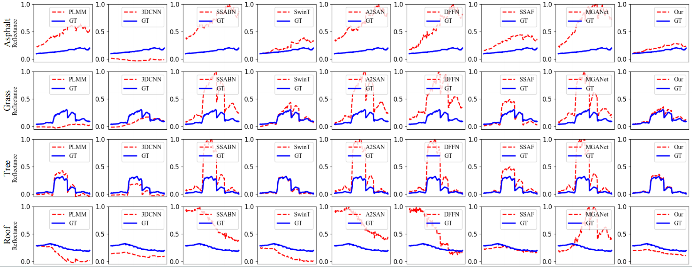
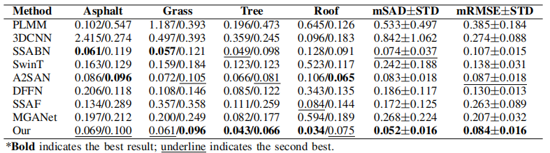

# Integrating Recurrent-KAN with SAM Adapter for Blind Hyperspectral Unmixing
---
Our [article](https://ieeexplore.ieee.org/document/11262218).


## Network

<div align="center">
  
  <p style="font-family: 'Times New Roman', font-size: 20 px; margin-top: 0px; margin-bottom: 10px;">
  The overall structure of the proposed method.
  </p>
</div>

<div align="center">
  
  <p style="font-family: 'Times New Roman', font-size: 20 px; margin-top: 0px; margin-bottom: 0px;">
  The design of HU-SAM adapter.
  </p>
</div>

## Results

### 1. Jasper Ridge

<div align="center">
  
  <p style="font-family: 'Times New Roman', font-size: 20 px; margin-top: 0px; margin-bottom: 10px;">
  <b>Figure</b> The abundance estimation results of different methods on the Jasper Ridge dataset.
  </p>
</div>
<div align="center">
  
  <p style="font-family: 'Times New Roman', font-size: 20 px; margin-top: 0px; margin-bottom: 10px;">
  <b>Figure</b> Endmembers obtained from various ground features by different methods on the Jasper Ridge dataset.
  </p>
</div>

<div align="center">
  <p style="font-family: 'Times New Roman', font-size: 20 px; margin-top: 15px; margin-bottom: 0px;">
  <b>Table</b> Comparison of different different methods on the Jasper Ridge dataset using SAD/RMSE
  </p>
  
</div>

### 2. Urban

<div align="center">
  
  <p style="font-family: 'Times New Roman', font-size: 20 px; margin-top: 0px; margin-bottom: 10px;">
  <b>Figure</b> The abundance estimation results of different methods on the Urban dataset.
  </p>
</div>
<div align="center">
  
  <p style="font-family: 'Times New Roman', font-size: 20 px; margin-top: 0px; margin-bottom: 10px;">
  <b>Figure</b> Endmembers obtained from various ground features by different methods on the Urban dataset.
  </p>
</div>
<div align="center">
  <p style="font-family: 'Times New Roman', font-size: 20 px; margin-top: 15px; margin-bottom: 0px;">
  <b>Table</b> Comparison of different different methods on the Urban dataset using SAD/RMSE
  </p>
  
</div>


## Licencing

Copyright (C) 2025 Yihao Fu

This program is free software: you can redistribute it and/or modify it under the terms of the GNU General Public License as published by the Free Software Foundation, version 3 of the License.

This program is distributed in the hope that it will be useful, but WITHOUT ANY WARRANTY; without even the implied warranty of MERCHANTABILITY or FITNESS FOR A PARTICULAR PURPOSE. See the GNU General Public License for more details.

You should have received a copy of the GNU General Public License along with this program.


## Contact
If you have any questions, please contact me by email (fuyihao@stumail.nwu.edu.cn).

## Citation

If our code is helpful to you, please cite:
```
@ARTICLE{11262218,
  author={Fu, Yihao and Gao, Tong and Peng, Shenglin and Chen, Jie and Yu, Kai and Wang, Jun and Peng, Jinye and Gabbouj, Moncef},
  journal={IEEE Transactions on Geoscience and Remote Sensing}, 
  title={Integrating Recurrent-KAN with SAM Adapter for Blind Hyperspectral Unmixing}, 
  year={2025},
  volume={},
  number={},
  pages={1-1},
  keywords={Feature extraction;Adaptation models;Hyperspectral imaging;Estimation;Accuracy;Splines (mathematics);Computational modeling;Graphical models;Distribution functions;Mixture models;Blind hyperspectral unmixing;Kolmogorov-Arnold networks;Segment anything model;Linear spectral mixture model},
  doi={10.1109/TGRS.2025.3635216}}
```
